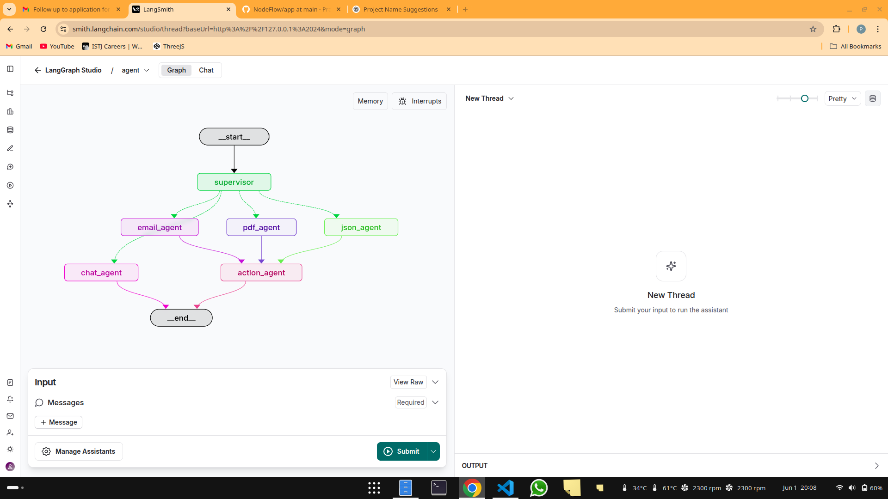

# FlowBit: Multi-Agent Document Processing System

FlowBit is an advanced document processing system built with LangGraph, LangChain, and FastAPI. It utilizes a multi-agent architecture to process different types of documents (emails, PDFs, JSON) and automatically takes appropriate actions based on document content.

## System Architecture

FlowBit consists of three main components:

1. **FastAPI Backend** (`main.py`): Provides RESTful API endpoints for handling escalations, alerts, and compliance flags.
2. **Agent Workflow**: 
   - `agent_workflow.py`: Implements a LangGraph-based agent system with command-line interface (CLI) output
   - `app/src/agent/graph.py`: Core graph implementation that can be visualized with the LangGraph UI

## Features

### Document Processing

- **Email Analysis**: Extracts sender, urgency, issue, tone and determines if escalation is needed
- **PDF Analysis**: Identifies document type (invoice, policy), extracts key information, flags high-value invoices
- **JSON Validation**: Validates webhooks against expected schemas, detects missing or invalid fields

### Automated Actions

- **CRM Escalations**: Automatically escalates high-urgency emails or those with threatening/escalation tone
- **Alert Logging**: Tracks system alerts for invalid data or potential issues
- **Compliance Flagging**: Marks documents that require special attention due to regulatory terms or high values

### Workflow Orchestration

- Uses LangGraph for managing agent workflow and state
- Supervisor agent determines the appropriate specialized agent for each input
- Action agent calls appropriate FastAPI endpoints based on processing results

## API Endpoints

| Endpoint | Method | Description |
|----------|--------|-------------|
| `/crm/escalate` | POST | Escalates issues from email analysis |
| `/alert/log` | POST | Logs alerts for invalid data or anomalies |
| `/compliance/flag` | POST | Flags documents needing compliance review |

## Database

The system uses SQLite for data persistence with the following tables:

- `crm_escalations`: Stores escalated customer issues
- `alert_logs`: Records system alerts
- `compliance_flags`: Tracks documents flagged for compliance review

## Setup and Dependencies

### Requirements

- Python 3.10+
- FastAPI
- LangGraph
- LangChain
- Redis (for checkpointing)
- Groq API key for LLM access

### Installation

1. Clone the repository
2. Install dependencies:
   ```bash
   pip install -r requirements.txt
   ```
3. Set up environment variables:
   ```
   GROQ_API_KEY=your_groq_api_key
   ```
4. Start Redis server (for state management)
5. Run the FastAPI server:
   ```bash
   uvicorn main:app --reload
   ```

### Usage

### Processing a Document

Run the agent workflow with a document path:

```python
from agent_workflow import run_workflow

# Process an email
run_workflow("File: /path/to/document.eml")

# Process a PDF
run_workflow("File: /path/to/invoice.pdf")

# Process a JSON webhook
run_workflow("File: /path/to/webhook.json")
```

### Visualizing the Agent Graph

To visualize and interact with the agent graph through the LangGraph UI:

```bash
# Navigate to the app directory
cd app

# Start the LangGraph development server
langgraph dev

# Open the displayed URL (usually http://localhost:3000) in your browser
```

This provides an interactive visualization of the agent workflow, allowing you to trace execution paths and debug agent interactions.



### Using the API Directly

```bash
# Escalate a CRM issue
curl -X POST "http://localhost:8000/crm/escalate" \
  -H "Content-Type: application/json" \
  -d '{"sender": "customer@example.com", "issue": "Service outage", "urgency": "HIGH"}'

# Log an alert
curl -X POST "http://localhost:8000/alert/log" \
  -H "Content-Type: application/json" \
  -d '{"alert_type": "Payment Webhook Validation Error"}'

# Flag a compliance issue
curl -X POST "http://localhost:8000/compliance/flag" \
  -H "Content-Type: application/json" \
  -d '{"document_type": "policy", "issue": "GDPR terms missing"}'
```

## Sample Files

The repository includes sample files for testing:

- `sample_email.eml`: Example email for testing email processing
- `sample_invoice.pdf` & `sample_policy.pdf`: PDF documents for testing
- `sample_webhook_valid.json` & `sample_webhook_invalid.json`: JSON webhooks for testing validation

## Notes

- `agent_workflow.py` provides a command-line interface for testing and using the system, but does not have a graphical interface.
- The core agent graph implementation in `app/src/agent/graph.py` can be visualized using the LangGraph development server.
- `classifier_agent.py` is a separate experimental implementation and not part of the main workflow.

## Future Development

- Integration with external CRM systems
- Support for additional document types
- Enhanced compliance checking with regulatory frameworks
- Web interface for monitoring and management